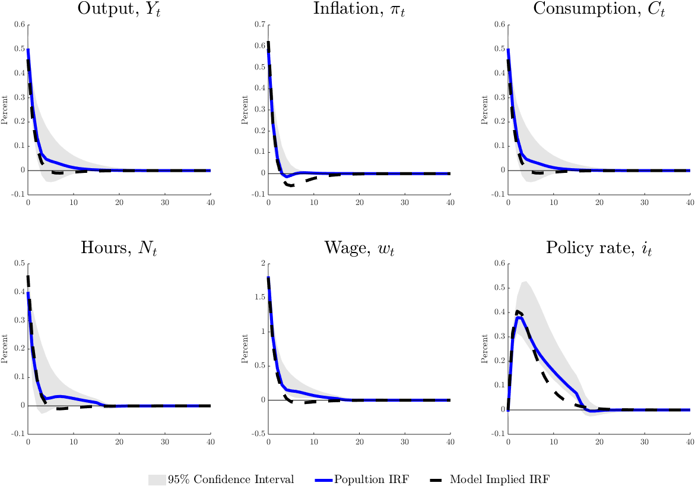
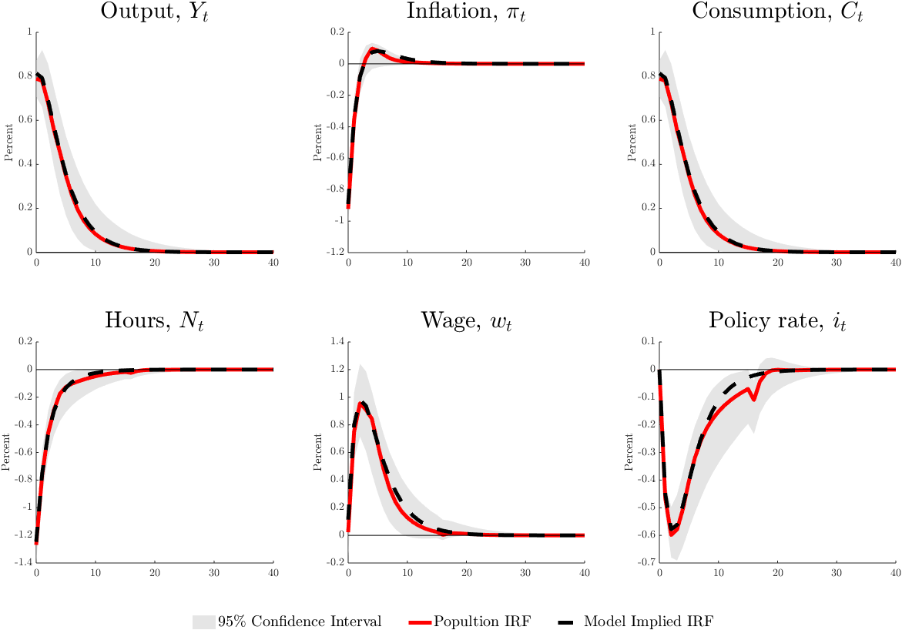
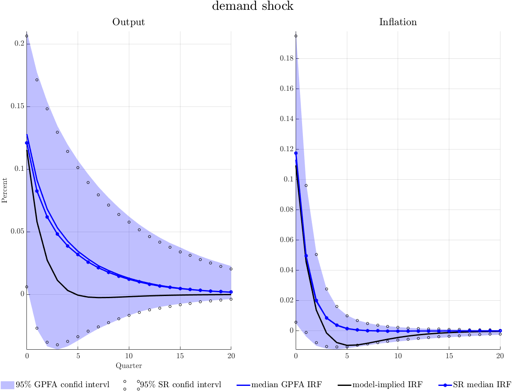
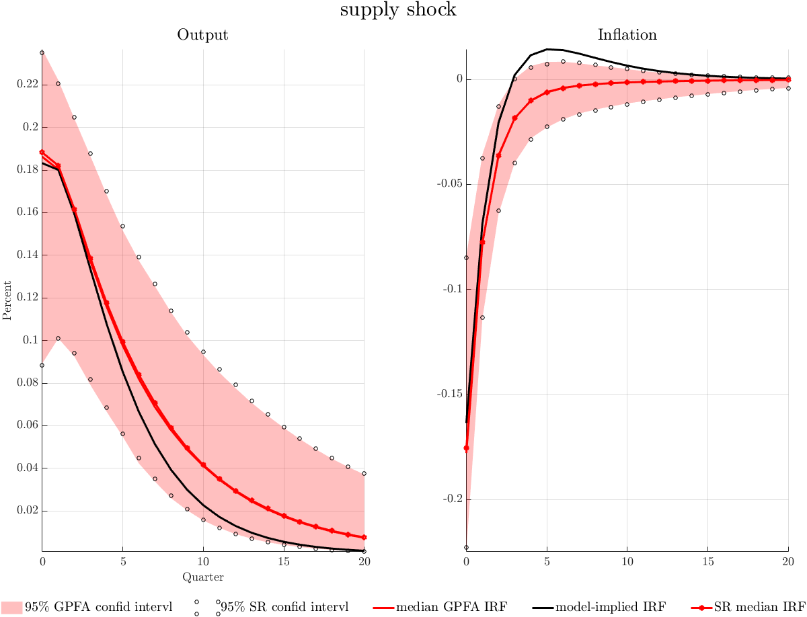

# Generalized Penalty Function Approach

We used a new identification strategy to identify the aggregate demand and the aggregate supply shock on real U.S. data. The simulation study and the robust test show that this identification strategy works well

* the estimated implied impulse response functions are consistent with the model-implied impulse response functions
* the estimated shocks and actuals shocks are very highly correlated. 

The empirical results indicate that GDP is less persistent than inflation in response to the demand shock, whereas GDP is more persistent than inflation to the supply shock.

### Identification Scheme

Consider the following VAR model:
$$
X_t=B(L)X_{t-1}+u_t
$$
$u_t$ is the reduced-form innovations and $E(u_tu_t^{'})=\Sigma$, is the variance-covariance of the $u_t=[u^Y_t, u^{\pi}_t, \cdots, u^{n}_t]^{'}$. The objective of the identification strategy is to identify structural shocks of interest: the demand shock ($\epsilon^D_t$) and the supply shock ($\epsilon^S_t$) from the reduced-form innovations with a proper structural impact matrix $A$, such that $A\epsilon_t=u_t$, and $E(\epsilon_t\epsilon_t^{'})=I$ and $\epsilon_t=[\epsilon^D_t, \epsilon^S_t,\cdots]$. 

In order to identify the demand and supply shocks, according to the AD-AS model, we have the following information at hand for identification: the demand shock, $\epsilon^D_t$, imposes a positive impact on both output, $Y_t$, and inflation, $\pi_t$, and the supply shock, $\epsilon^S_t$, imposes a positive impact on the output, $Y_t$, and a negative impact on the inflation, $\pi_t$.

The identification strategy described as follows: Decompose $A=CD$ where $C$ is the Cholesky decomposition of $\Sigma$ and $D=[d_D, d_S, ...]$ is an orthogonal matrix where:
$$
d_D=\mathop{\arg\max}_{d}\,\{\delta^{*}e_1Cd+(1-\delta^{*})e_2Cd,\;\;\text{subject to}\;\;d^{'}d=1\}
$$
and 
$$
d_S=\mathop{\arg\max}_{d}\,\{\delta^{*}e_1Cd-(1-\delta^{*})e_2Cd,\;\;\text{subject to}\;\;d^{'}d=1\}
$$
where
$$
\delta^{*}\in(0,1) \;\;\text{is such that}\;\; d_D^{'}d_S=0
$$

### Impulse responses

We use a simple DSGE model to simulate data and use the simulated data to estimate the impulse response.

### What's more...

We also extend our method to bayesian estimation, codes can be found in the folder: bayesian.

### Thanks

This is a joint paper with my advisor, Dr. Marco Brianti. I wish to extend my deepest thanks to him for providing generous guidance on this project and the SVAR model's identification and estimation techniques.
